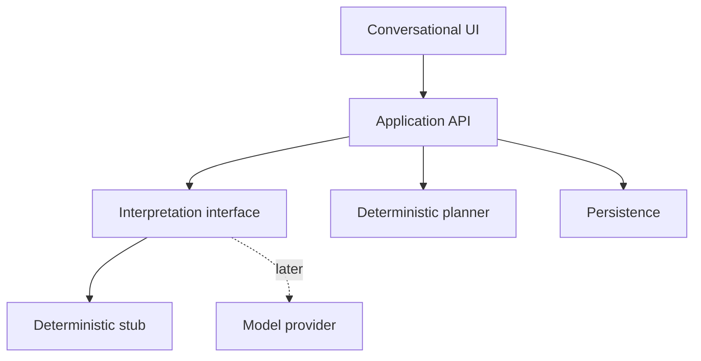

# Architecture

## System boundaries

The interpretation layer converts free-form language into structured proposals. It may suggest urgency, task boundaries, dependencies, emotional friction, and possible actions, but these remain proposals.

The deterministic planner owns enforceable behavior such as capacity limits, fixed commitments, break rules, user boundaries, eligibility, and tie-breaking. It records the factors behind each recommendation.

## Initial domain concepts

| Concept | Purpose |
|---|---|
| `Capture` | Preserves the user's original brain dump |
| `Task` | Represents an outcome inferred and later confirmed or corrected |
| `Action` | Represents a concrete, startable step belonging to a task |
| `CapacityCheckIn` | Records current time, energy, stress, and available capacity |
| `Plan` | Represents the current bounded recommendation context |
| `Recommendation` | Records an action suggestion and its explanation |
| `Response` | Records start, resize, defer, swap, or overwhelm feedback |
| `Outcome` | Records what actually happened after a response |

`Task` and `Action` remain separate. “Find a job” can be a long-lived task; “open the saved posting and check its requirements” is a startable action.

## Planned request path

1. The API stores the raw capture.
2. An interpreter returns structured task proposals.
3. The user corrects material ambiguity.
4. The planner filters actions through hard constraints.
5. The planner scores eligible actions using transparent factors.
6. The API stores the recommendation and explanation.
7. The user's response and eventual outcome become new evidence.
