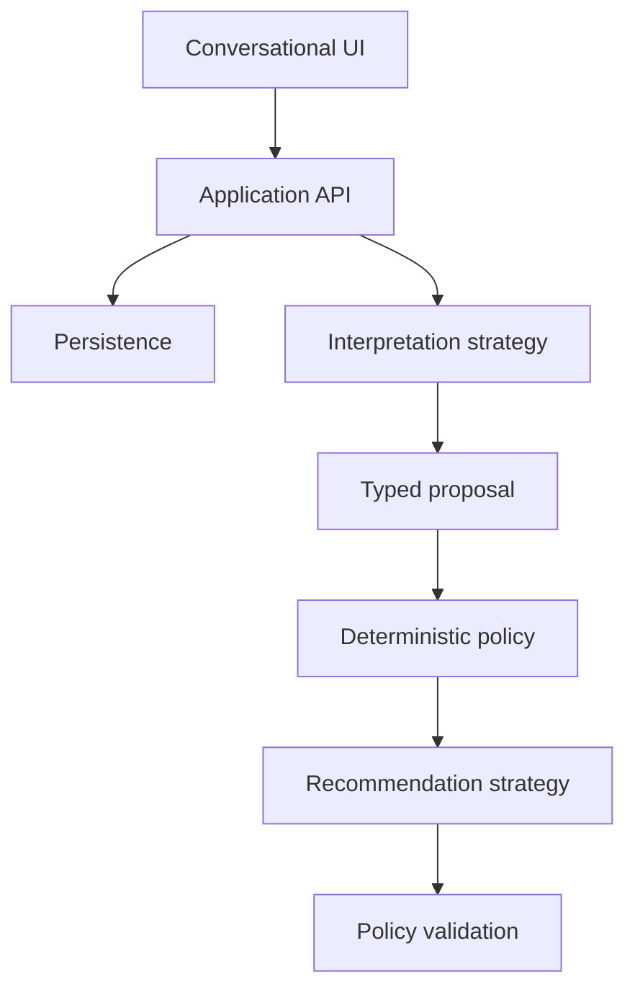

# Architecture

## System boundaries

The interpretation layer converts free-form language and available context into structured
proposals. A model may suggest task boundaries, possible actions, urgency, duration, dependencies,
or emotional friction. These values remain uncertain proposals rather than application facts.
The current provider-neutral boundary is documented in the
[interpretation contract](interpretation-contract.md).

The deterministic policy layer owns enforceable behavior: explicit deferrals, user boundaries,
dependency eligibility, completed or canceled state, and the precedence of user corrections.
Subjective values such as task duration remain sourced estimates for the recommendation strategy
to consider.

The recommendation strategy chooses among policy-eligible actions. The first strategy may use
transparent rules; later strategies may use a model, personalization, or a hybrid. Every result is
validated by policy before it is shown or persisted.

## Knowledge and uncertainty

Interpretation output distinguishes among:

| Kind | Example | Treatment |
|---|---|---|
| Observation | “The application closes Friday” | Preserve its evidence and source |
| Estimate | “This may take 20–40 minutes” | Store its range and confidence |
| Policy | “Honor this deferral through today” | Enforce deterministically |

Important interpreted values carry provenance such as `user`, `connected_source`, `model`,
`default`, or `learned`. Explicit user corrections are authoritative. Unknown values remain
unknown unless asking would materially change the recommendation.

## Initial domain concepts

| Concept | Purpose |
|---|---|
| `Capture` | Preserves the user's original brain dump |
| `Interpretation` | Versioned proposal derived from a capture and its available context |
| `Task` | Represents an outcome proposed and later confirmed or corrected |
| `Action` | Represents a concrete, startable step belonging to a task |
| `CapacityCheckIn` | Records current time, energy, stress, and available capacity |
| `Plan` | Represents the current bounded recommendation context |
| `Recommendation` | Records an action suggestion and its explanation |
| `Response` | Records start, resize, defer, swap, or overwhelm feedback |
| `Outcome` | Records what actually happened after a response |

`Task` and `Action` remain separate. “Find a job” can be a long-lived task; “open the saved posting and check its requirements” is a startable action.

## Planned request path

1. The API stores the raw capture.
2. An interpreter returns a typed, versioned proposal with provenance and uncertainty.
3. The system asks only about ambiguity that would materially change the next action.
4. Deterministic policy removes ineligible actions and applies explicit user intent.
5. A replaceable strategy recommends one eligible action and records structured factors.
6. Policy validates the recommendation before the API stores and returns it.
7. The user's response, correction, and eventual outcome become new evidence.
