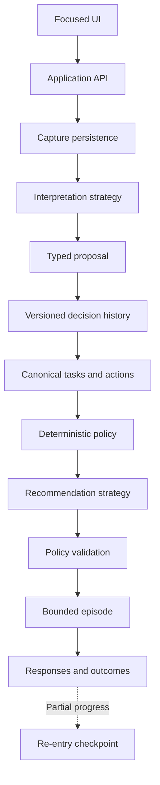

# Architecture

## Current implementation

| Boundary | Status |
|---|---|
| Capture UI and `POST /captures` | Implemented |
| Exact-text capture persistence in PostgreSQL | Implemented |
| Interpretation request, proposal models, and interpreter protocol | Implemented and tested in isolation |
| Interpretation orchestration and versioned proposal persistence | Implemented with a line-based fallback |
| Structured task and first-action review | Implemented; richer interpreted details remain read-only |
| Canonical task and action materialization | Implemented at confirmation, with migration backfill |
| Canonical task and action lifecycle | Implemented for listing, editing, completion, reopening, and archival |
| Secondary task-management UI | Implemented for completion, reopening, and archival; inline editing remains API-only |
| Bounded recommendation episodes, outcomes, and re-entry | Planned |
| Raw capture and complete proposal-history UI | Not designed yet |

The current user-facing path saves a capture, creates a versioned interpretation, and lets the user
add, edit, or remove proposed tasks and starting actions. Confirmation atomically creates another
immutable interpretation version and materializes its reviewed tasks and actions as canonical
application state. Reinterpreting and reconfirming the same capture archives the prior canonical
projection without deleting its history. The application restores non-archived canonical tasks
when it loads, but the list stays hidden until the user explicitly opens it. The secondary list
supports completion, reopening, and archival. The path currently ends there: there is no full
history surface, explicit context snapshot, bounded recommendation episode, outcome reporting, or
re-entry yet.

## Target system boundaries

```mermaid
flowchart TD
    UI["Focused UI"] --> API["Application API"]
    API --> STORE["Capture persistence"]
    STORE --> INTERPRET["Interpretation strategy"]
    INTERPRET --> PROPOSAL["Typed proposal"]
    PROPOSAL --> HISTORY["Versioned decision history"]
    HISTORY --> STATE["Canonical tasks and actions"]
    STATE --> POLICY["Deterministic policy"]
    POLICY --> RECOMMEND["Recommendation strategy"]
    RECOMMEND --> VALIDATE["Policy validation"]
    VALIDATE --> EPISODE["Bounded episode"]
    EPISODE --> EVENTS["Responses and outcomes"]
    EVENTS -. "Partial progress" .-> REENTRY["Re-entry checkpoint"]
```

The interpretation layer converts free-form language and available context into structured
proposals. A model may suggest task boundaries, possible actions, urgency, duration, or
dependencies. These values remain uncertain proposals rather than application facts.
The current provider-neutral boundary is documented in the
[interpretation contract](interpretation-contract.md).

The deterministic policy layer owns enforceable behavior: explicit deferrals, user boundaries,
dependency eligibility, completed or canceled state, and the precedence of user corrections.
Subjective values such as task duration remain sourced estimates for the recommendation strategy
to consider.

The recommendation strategy chooses among policy-eligible actions using an explicit context
snapshot. The first strategy may use transparent rules; later strategies may use a model,
personalization, or a hybrid. Every result is validated by policy before it is stored as a
bounded recommendation episode.

## Knowledge and uncertainty

Interpretation output distinguishes among:

| Kind | Example | Treatment |
|---|---|---|
| Observation | “The application closes Friday” | Preserve its evidence and source |
| Estimate | “This may take 20–40 minutes” | Store its range and confidence |
| Policy | “Honor this deferral through today” | Enforce deterministically |

Important interpreted values carry provenance such as `user`, `connected_source`, `model`,
`default`, or `learned`. Explicit user corrections are authoritative. Unknown values remain
unknown unless asking would materially change the recommendation.

## Target domain concepts

| Concept | Purpose |
|---|---|
| `Capture` | Preserves the user's original brain dump |
| `Interpretation` | Versioned proposal derived from a capture and its available context |
| `Task` | Represents a canonical persistent outcome with an explicit active, completed, or archived lifecycle |
| `Action` | Represents a concrete, startable step belonging to a task |
| `ContextSnapshot` | Records optional, explicit context such as available time, a request for something easier, and known constraints |
| `RecommendationEpisode` | Records one bounded commitment, its stopping condition, explanation factors, context, and strategy version |
| `EpisodeEvent` | Appends acceptance, resize, defer, swap, overwhelm, and reported-outcome evidence |
| `ReentryCheckpoint` | Preserves where the user stopped and a useful way back into unfinished work |

`Task` and `Action` remain separate. “Update my resume” can be a long-lived task; “revise the
summary” is a startable action. A recommendation episode can turn that action into “revise the
summary for 10 minutes,” adding the current commitment and its stopping boundary without claiming
that the larger task will be completed.

Accepting an episode does not prove work began. “Done for now” satisfies the bounded commitment,
not the persistent task. Task completion is an explicit user action, and a missing outcome remains
unknown. [ADR 0006](decisions/0006-bounded-recommendation-episodes.md) defines the lifecycle.

## Observability and traceability

Weavance separates operational telemetry and product decision history because they answer
different questions:

- Structured logs, metrics, and traces describe how a request or background operation executed.
- Versioned PostgreSQL records describe why an interpretation or recommendation was produced.

Structured request, capture, and interpretation events, request IDs, safe metadata, local console
formatting, and deployed JSON formatting are implemented. User-authored content stays out of
routine logs. Versioned interpretation history is implemented; recommendation history is planned.

OpenTelemetry is the planned instrumentation boundary, with Prometheus, Loki, Tempo, and Grafana
added when the interpretation workflow provides meaningful signals to observe. See
[ADR 0005](decisions/0005-observability-foundation.md).

## Request path

1. The API stores the raw capture.
2. An interpreter returns a typed proposal with provenance and uncertainty.
3. The API validates and stores it as a new versioned interpretation linked to the capture.
4. The current structured review records user additions, edits, removals, and confirmation as a new
   version.
5. Confirmation materializes canonical tasks and actions in the same transaction while preserving
   their links to capture and interpretation history.
6. The task API lists and updates canonical state without rewriting that source history.
7. Future reviews should narrow questions to ambiguity that would materially change the next
   action.
8. Deterministic policy will remove ineligible actions and apply explicit user intent.
9. A replaceable strategy will combine eligible actions with an explicit context snapshot and
   propose one bounded commitment.
10. Policy will validate the entry point, stopping condition, and explanation before the API
    stores the recommendation episode.
11. Episode events will record explicit responses and reported outcomes without inferring an
    answer from silence.
12. Partial progress may create a checkpoint for a future re-entry episode.
