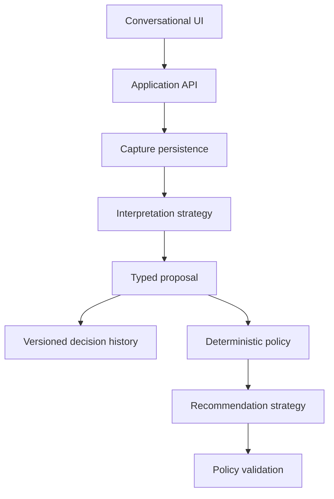

# Architecture

## Current implementation

| Boundary | Status |
|---|---|
| Capture UI and `POST /captures` | Implemented |
| Exact-text capture persistence in PostgreSQL | Implemented |
| Interpretation request, proposal models, and interpreter protocol | Implemented and tested in isolation |
| Interpretation orchestration and versioned proposal persistence | Implemented with a line-based fallback |
| Structured task and first-action review | Implemented; richer interpreted details remain read-only |
| Cumulative confirmed-task read model and secondary UI | Implemented |
| Policy, recommendation, and feedback loop | Planned |
| Raw capture and complete proposal-history UI | Not designed yet |

The current user-facing path saves a capture, creates a versioned interpretation, and lets the user
add, edit, or remove proposed tasks and starting actions. Confirmation creates another immutable
interpretation version with user-correction provenance. The latest confirmed version from every
capture is restored when the application loads, but the cumulative list stays hidden until the
user explicitly opens it. The path currently ends there: there is no task lifecycle, full history
surface, capacity inference, or next-action recommendation yet.

## Target system boundaries

```mermaid
flowchart TD
    UI["Conversational UI"] --> API["Application API"]
    API --> STORE["Capture persistence"]
    STORE --> INTERPRET["Interpretation strategy"]
    INTERPRET --> PROPOSAL["Typed proposal"]
    PROPOSAL --> HISTORY["Versioned decision history"]
    PROPOSAL --> POLICY["Deterministic policy"]
    POLICY --> RECOMMEND["Recommendation strategy"]
    RECOMMEND --> VALIDATE["Policy validation"]
```

The interpretation layer converts free-form language and available context into structured
proposals. A model may suggest task boundaries, possible actions, urgency, duration, dependencies,
or emotional friction. These values remain uncertain proposals rather than application facts.
The current provider-neutral boundary is documented in the
[interpretation contract](interpretation-contract.md).

The deterministic policy layer owns enforceable behavior: explicit deferrals, user boundaries,
dependency eligibility, completed or canceled state, and the precedence of user corrections.
Subjective values such as task duration remain sourced estimates for the recommendation strategy
to consider.

The recommendation strategy chooses among policy-eligible actions. The first strategy may use
transparent rules; later strategies may use a model, personalization, or a hybrid. Every result is
validated by policy before it is shown or persisted.

## Knowledge and uncertainty

Interpretation output distinguishes among:

| Kind | Example | Treatment |
|---|---|---|
| Observation | “The application closes Friday” | Preserve its evidence and source |
| Estimate | “This may take 20–40 minutes” | Store its range and confidence |
| Policy | “Honor this deferral through today” | Enforce deterministically |

Important interpreted values carry provenance such as `user`, `connected_source`, `model`,
`default`, or `learned`. Explicit user corrections are authoritative. Unknown values remain
unknown unless asking would materially change the recommendation.

## Target domain concepts

| Concept | Purpose |
|---|---|
| `Capture` | Preserves the user's original brain dump |
| `Interpretation` | Versioned proposal derived from a capture and its available context |
| `Task` | Represents an outcome proposed and later confirmed or corrected |
| `Action` | Represents a concrete, startable step belonging to a task |
| `CapacityCheckIn` | Records current time, energy, stress, and available capacity |
| `Plan` | Represents the current bounded recommendation context |
| `Recommendation` | Records an action suggestion and its explanation |
| `Response` | Records start, resize, defer, swap, or overwhelm feedback |
| `Outcome` | Records what actually happened after a response |

`Task` and `Action` remain separate. “Find a job” can be a long-lived task; “open the saved posting and check its requirements” is a startable action.

## Observability and traceability

Weavance separates operational telemetry and product decision history because they answer
different questions:

- Structured logs, metrics, and traces describe how a request or background operation executed.
- Versioned PostgreSQL records describe why an interpretation or recommendation was produced.

Structured request, capture, and interpretation events, request IDs, safe metadata, local console
formatting, and deployed JSON formatting are implemented. User-authored content stays out of
routine logs. Versioned interpretation history is implemented; recommendation history is planned.

OpenTelemetry is the planned instrumentation boundary, with Prometheus, Loki, Tempo, and Grafana
added when the interpretation workflow provides meaningful signals to observe. See
[ADR 0005](decisions/0005-observability-foundation.md).

## Request path

1. The API stores the raw capture.
2. An interpreter returns a typed proposal with provenance and uncertainty.
3. The API validates and stores it as a new versioned interpretation linked to the capture.
4. The current structured review records user additions, edits, removals, and confirmation as a new
   version.
5. The current task-list read model selects the latest confirmed version for every capture and,
   when explicitly opened, presents their tasks together without rewriting interpretation history.
6. Future reviews should narrow questions to ambiguity that would materially change the next
   action.
7. Deterministic policy will remove ineligible actions and apply explicit user intent.
8. A replaceable strategy will recommend one eligible action and record structured factors.
9. Policy will validate the recommendation before the API stores and returns it.
10. The user's response, correction, and eventual outcome will become new evidence.
