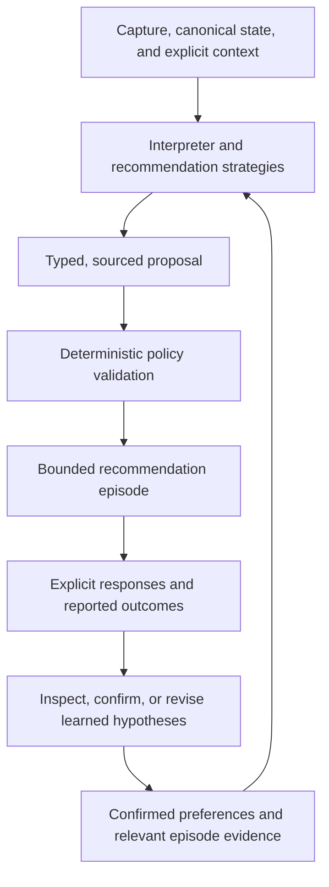

# LLM integration and adaptive personalization

## Status

This document records the intended product and architecture direction for adding model-assisted
interpretation, recommendations, and longitudinal personalization to Weavance. It expands the
accepted boundaries in [ADR 0003](decisions/0003-inference-policy-and-recommendation.md) and
[ADR 0006](decisions/0006-bounded-recommendation-episodes.md).

The provider-neutral interpretation contract, deterministic fallback, persisted context snapshots,
bounded recommendation episodes, explicit episode responses, and user-authored re-entry
checkpoints already exist. The current UI still uses the empty/default context snapshot; collecting
available time, easier-work requests, and constraints remains planned. A live model, learned
preferences, and model-assisted recommendation strategies are not implemented yet.

This is a design direction rather than a final persistence or API contract. Sections labeled
**Proposed** identify details that still need an ADR or implementation decision.

## Product intent

The LLM should help Weavance understand language and make useful suggestions where rigid rules are
not enough. Over time, the product should adapt to what the user explicitly says and reports so
that it can offer a better-sized, more relevant starting point with less repeated explanation.

Personalization should feel like accumulated understanding, not hidden profiling. The user should
be able to tell what Weavance knows, correct it, and override it in the moment.

The objective is not to maximize task completions, time in the application, or acceptance rate. It
is to help the user begin a useful bounded commitment and find a manageable way back after an
interruption while preserving their authority.

## Established boundaries

The following decisions are already part of the Weavance product contract:

- Model output is a proposal, not authoritative application state.
- Raw captures and versioned interpretations are preserved so suggestions remain traceable.
- The user reviews material task and action interpretations before they become canonical state.
- Deterministic policy enforces lifecycle state, eligibility, explicit boundaries, and invariants.
- Recommendation strategies are replaceable and are validated by policy before persistence.
- Recommendations use explicit context rather than claiming to know capacity, motivation, or
  mental state.
- One recommendation is a bounded episode with an entry point, stopping condition, reason, and
  strategy version.
- Accepting a recommendation, beginning work, satisfying its boundary, and completing the task are
  distinct events.
- Silence is not success, failure, avoidance, or any other behavioral signal.
- The application must retain a useful deterministic fallback and must not require a model provider
  or API key for its core data to remain accessible.

## Appropriate uses of an LLM

### Interpret captures

A model can turn an unstructured brain dump into typed task and action proposals. It may suggest:

- task boundaries and concise titles
- startable actions
- deadline observations
- duration ranges
- dependencies or ambiguity worth reviewing

Every inferred value carries provenance and uncertainty. The model does not silently write these
values into canonical task state.

### Suggest task decomposition

For vague or large tasks, a model may propose smaller tasks or actions only when it can do so
without inventing requirements, priorities, or completion criteria. The original task and its
provenance remain intact, and the breakdown remains editable until confirmed.

If confidence is low, Weavance should ask one focused question or propose a bounded discovery
action instead of generating plausible-looking busywork.

For example:

```text
Task: Update resume

Possible actions:
- Review the professional summary
- Update the most recent role
- Proofread content and formatting
```

By contrast, `Work on Weavance` may require current project state before a useful breakdown is
possible.

### Propose a bounded recommendation

After deterministic policy removes ineligible tasks and actions, a model-assisted recommendation
strategy may consider the remaining candidates, the current explicit context snapshot, confirmed
preferences, and relevant prior episode evidence. It proposes one commitment containing:

- a canonical task and action
- a concrete place to begin
- a protected timebox or other stopping condition
- a concise reason grounded in the information actually used

Policy then verifies eligibility, references, explicit deferrals, lifecycle state, and the
available-time boundary before the episode is stored or shown.

### Support re-entry

When the user reports partial progress or an interruption, a model may turn a saved checkpoint into
a smaller way back into the same work. It should use what the user reported about where they
stopped, not merely repeat the original task or assume what happened.

### Ask a focused question

When one missing answer would materially change the recommendation, the model may ask a single
focused question. It should prefer a reasonable bounded suggestion when the ambiguity is minor so
that clarification does not become another planning burden.

## Uses that remain out of bounds

An LLM must not:

- complete, archive, defer, delete, or otherwise mutate canonical state without an explicit user
  action
- infer that work started or finished from acceptance, elapsed time, or silence
- invent a deadline, dependency, preference, or personal fact and present it as known
- diagnose the user or label their motivation, capacity, mood, or mental state
- autonomously control a calendar or schedule
- bypass deterministic policy because a recommendation sounds reasonable
- turn a tentative behavior pattern into a permanent user trait
- expose unrelated historical or sensitive context to a model when a smaller context window is
  sufficient

## System boundary



The model-facing layer receives a deliberately selected view of application state. It should not
receive an undifferentiated dump of the user's entire history. Prompt inputs, model/provider
identity, strategy version, output schema version, and the facts used in an explanation must remain
traceable enough to reproduce or audit a recommendation.

## What “learning” means

Initial personalization should not mean fine-tuning a model on one user's data. It should mean
maintaining structured, inspectable knowledge that any recommendation strategy can use.

There are three useful categories:

| Category | Example | Treatment |
|---|---|---|
| Explicit fact or preference | “Phone calls need to happen before 4.” | Store as user-sourced and authoritative within its scope. |
| Reported episode evidence | The user selected **Make it smaller** for a 20-minute commitment. | Preserve as an event describing that episode only. |
| Learned hypothesis | The user may prefer five-minute starting commitments when little time is available. | Keep tentative, scoped, revisable, and lower authority than current input. |

The application learns from evidence such as:

- corrections made during interpretation review
- task and action additions, removals, and edits
- Start, Make it smaller, Not right now, Swap task, and I'm overwhelmed responses
- Done for now, progress made, did not start, and keep going reports
- whether the user says the stopping point was honored
- explicit feedback that a suggestion helped or added pressure
- re-entry checkpoints and later re-entry responses

Task completion remains a separate lifecycle event. It must not retroactively imply that every
earlier recommendation was useful. Likewise, no response creates no learning signal.

## Evidence precedence

When information conflicts, recommendation behavior should follow this order:

1. The user's current explicit instruction or correction
2. The current explicit context snapshot and boundaries
3. A confirmed durable fact or preference
4. A user-reported outcome or checkpoint relevant to the same work
5. A behavior-derived hypothesis supported by multiple observations
6. General knowledge or a product default

Newer evidence does not always erase older evidence. A preference can be scoped to a task type,
time constraint, or situation, and it can weaken when it has not been supported recently. Current
explicit intent always wins.

## Proposed personalization record

**Proposed:** Store learned knowledge separately from raw episode history. A future preference or
hypothesis record should be able to answer:

- What does Weavance believe might be useful?
- Is it an explicit statement or a derived pattern?
- Which observations support it?
- Where and when does it apply?
- How certain is the derivation?
- Has the user confirmed, corrected, dismissed, or deleted it?
- When was it last supported or contradicted?

A record may eventually include fields conceptually similar to:

```text
dimension: preferred_commitment_minutes
value: 5
scope: available_time <= 20 minutes
evidence_source: observed_behavior
derivation: learned
supporting_event_ids: [...]
confidence: 0.72
status: hypothesis
last_supported_at: ...
```

This should be interpreted narrowly: “a five-minute starting point may work better in this
context.” It must not become “the user lacks capacity for longer work.”

## Confidence and provenance

Confidence describes the system's certainty that a particular derivation is supported by its
evidence. It does not mean that the task is important, the action is a good recommendation, or the
user will complete it.

For example, the current deterministic interpreter can assign confidence `1.0` when it copies a
line directly into a task proposal. That means the rule and evidence relationship are certain. It
does not mean the line was fully understood.

Personalization will likely require separate concepts rather than overloading one confidence
number:

- **Derivation confidence:** How strongly the evidence supports the inferred value
- **Support count and recency:** How much relevant evidence exists and how current it is
- **Recommendation score:** How the strategy ranked an eligible action for this context
- **User confirmation state:** Whether the user explicitly accepted the learned value

A user-confirmed preference can therefore outrank a higher-scoring behavioral hypothesis even if
the hypothesis has more observations.

## Applying learned knowledge

**Proposed:** Use staged authority for learned information:

1. **Observe.** Preserve explicit episode events without generalizing them.
2. **Form a hypothesis.** After repeated, contextually similar evidence, create a tentative and
   scoped pattern.
3. **Apply conservatively.** Use the hypothesis as a tie-breaker or sizing input, never to violate a
   current boundary.
4. **Confirm when material.** Ask the user to confirm a pattern before it meaningfully changes
   behavior across contexts.
5. **Revise or decay.** Weaken or retire patterns that are contradicted or no longer supported.

Example:

```text
Observed evidence:
- Three 20-minute recommendations were resized to five minutes when less than 30 minutes was
  available.
- Two five-minute recommendations in that context led to reported progress.

Tentative hypothesis:
- When available time is under 30 minutes, prefer a five-minute entry point.

Possible user-facing confirmation:
- “Shorter starting steps seem to work better when you have less than half an hour. Should I keep
  using that as a default?”
```

The system should not infer this pattern from a single resize, and it should not apply the pattern
when the user explicitly requests a longer work block.

## Explanations

An explanation should name the few decision factors that actually changed the recommendation. It
should distinguish current context, explicit preferences, and tentative learned patterns.

Good:

```text
Why: You have 20 minutes, and you've asked for shorter starting steps in similar situations.
```

Avoid:

```text
Why: You tend to avoid difficult work and have low energy right now.
```

The first explanation is tied to explicit or reportable evidence. The second invents a mental
state and turns behavior into a judgment.

## User control and privacy

**Proposed:** Before behavior-derived personalization becomes active, the product should provide a
small “What Weavance has learned” surface where the user can:

- inspect confirmed preferences and tentative hypotheses
- see a concise explanation of their supporting evidence
- correct, confirm, dismiss, or delete a learned item
- prevent an item from being learned again when appropriate
- disable behavior-derived personalization while retaining basic task functionality

Provider requests should include only the context needed for the current operation. User-authored
content must remain out of routine operational logs. Retention, deletion, export, hosted-provider
data handling, and local-model behavior require explicit product decisions before implementation.

## Reliability and degraded behavior

Model integration should fail closed toward the existing deterministic behavior:

- Validate all model output against the provider-neutral typed contract.
- Reject unknown fields and invalid canonical references.
- Apply timeouts and bounded retries around provider calls.
- Fall back to deterministic interpretation or recommendation when a model is unavailable.
- Never discard a capture because interpretation failed.
- Never partially apply a proposal as canonical state.
- Persist provider, model, prompt/strategy, and schema versions without making provider-specific
  fields part of the core domain.

The deterministic fallback is intentionally modest. It protects availability and ownership of the
user's data; it does not need to imitate the full quality of a model-assisted experience.

## Evaluation

Model quality should be evaluated against the product boundaries, not only whether a suggestion
sounds plausible.

### Interpretation evaluation

- schema validity
- fidelity to the source text
- unsupported task, deadline, or dependency rate
- quality and startability of proposed actions
- calibration of uncertainty
- how often review requires material correction

### Recommendation evaluation

- policy-violation rate, which should be zero
- whether the action is startable and the stopping condition is genuinely bounded
- resize, defer, swap, and overwhelmed response rates
- user-reported progress and done-for-now outcomes
- whether the promised boundary was honored
- whether explanations cite factors that were actually used
- acceptance of later re-entry suggestions

Acceptance alone is not success, and task completion alone does not identify which recommendation
helped. Offline replay against versioned history can compare strategies without silently changing
what the user sees. Any online comparison should preserve one clear recommendation and avoid
engagement-oriented pressure.

## Delivery sequence

1. **Complete the episode loop — implemented.** Explicit pre-start responses, reported outcomes,
   and user-authored re-entry checkpoints now provide honest episode evidence without inferring
   outcomes from silence.
2. **Collect explicit recommendation context.** Let the user supply available time, an easier-work
   request, and constraints through the UI so strategies receive meaningful current context rather
   than only the persisted empty/default snapshot.
3. **Live interpretation provider.** Implement one hosted or local model behind the existing
   `CaptureInterpreter` protocol, with structured output, timeouts, versioning, and deterministic
   fallback.
4. **Model-assisted recommendation.** Add a strategy that can rank policy-eligible actions and
   propose bounded entry/stopping language without learning across sessions yet.
5. **Explicit preferences.** Let the user state and manage durable recommendation preferences.
6. **Derived hypotheses.** Compute conservative, scoped patterns from sufficient episode evidence,
   with inspection and correction controls.
7. **Strategy evaluation.** Replay versioned episodes, measure calibration and boundary adherence,
   and promote strategies through explicit versions.

This sequence ensures Weavance collects honest signals before claiming to learn from them.

## Open decisions

- Which hosted or local model should be the first production interpreter?
- What provider data-retention requirements are acceptable?
- Which prompt and response artifacts must be persisted for reproducibility without retaining
  unnecessary sensitive text?
- What evidence threshold is sufficient to form or apply a learned hypothesis?
- Which learned values require confirmation before use?
- How should preference scope, contradiction, decay, and expiration work?
- Should task decomposition create child tasks, actions, or either depending on the task?
- How should users inspect and delete model history and learned knowledge?
- Which connected sources, if any, may supply context, and how is each source authorized?
- When should Weavance ask a question instead of making a bounded best-effort suggestion?
